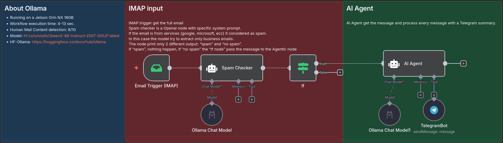

# n8n.workflows
Some LAB Worklows which my get used as helpers and for learning N8N and/or LLM handling and Tool calling.
This is my motivation:
* Low ressource footprint (for llm)
* Learning effect (how to use and wire together)
* Be useful (do something that helps)
* Run on-prem if possible (not all of my WFs, My DGX Spark is still in transit :-) )

## Mail Assistant TelegramBot with Ollama

