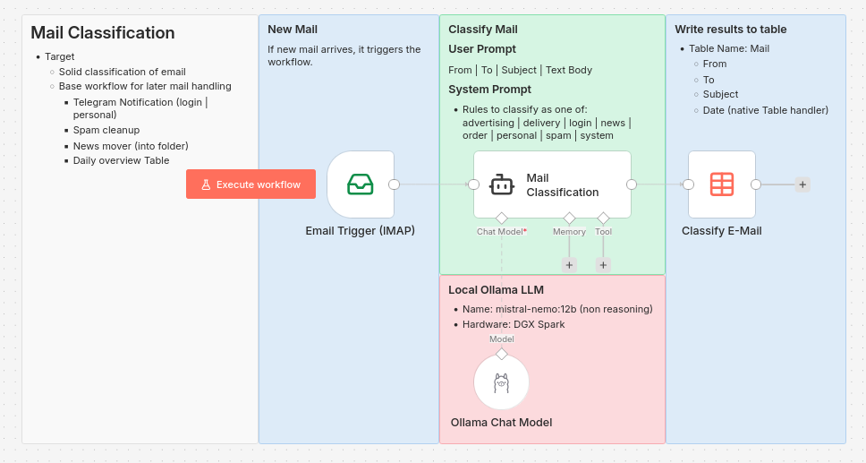

# n8n.workflows
Some LAB Worklows which my get used as helpers and for learning N8N and/or LLM handling and Tool calling.
This is my motivation:
* Low ressource footprint (for llm)
* Learning effect (how to use and wire together)
* Be useful (do something that helps)
* Run on-prem if possible (not all of my WFs, My DGX Spark is still in transit :-) )

## Mail Assistant TelegramBot with Ollama
This is my first test for classify emails and directly shoot an an action

## Mail Classification with Ollama and Table
This is a base workflow for later usage.
Its target is to result in a solid mail classification as I would do.

